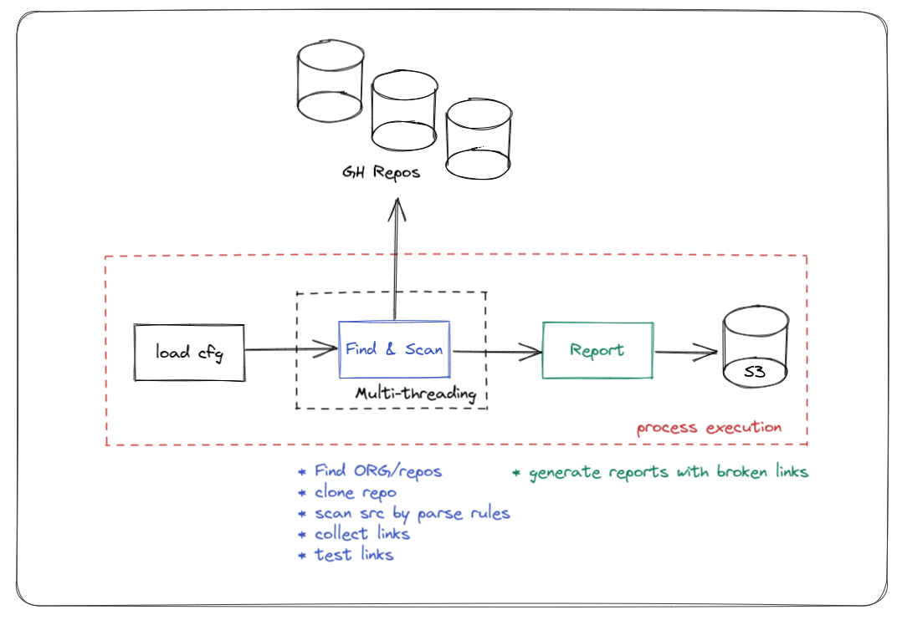
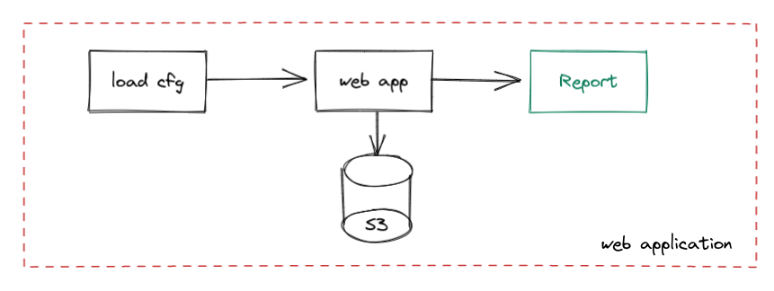

[](https://github.com/eduardocerqueira/linknotfound/actions/workflows/ci.yml)
[](https://svgshare.com/i/Zhy.svg)
[](https://GitHub.com/eduardocerqueira/linknotfound/tags/)
[](https://GitHub.com/eduardocerqueira/linknotfound/issues/)


# linknotfound

This project is a POC, [proof of concept](https://en.wikipedia.org/wiki/Proof_of_concept) for a simple tool to find and
report broken links from an application source code.

It is a **client** and **server** applications, where the client also referred as scanner collect and analyze the
repos and send the report to S3 bucket. The server is retrieves the reports from S3 bucket and present to the user.

_This repository doesn't intend to be a final version of this poc, as well should not run in a production
environment, as a public and open-source code you can use it with your own risks and contributions are welcome!._

## diagrams

<br>
_high-level overview for the scanner client application_

<br>
_web application_

<br>
_automation using GitHub workflow, triggered by new PR event_

<br>
_not implemented, future idea integrating with GH PR and workflow_

# Contributing and running the application

## Requirements
* GitHub OauthAPI GITHUB_TOKEN
* Python 3

## Development environment

From the path ./linknotfound run the script below to set developer environment for this program in a consistent way:

```shell
sh ops/scripts/set_dev_env.sh
```

Or if you prefer to set it manually, from the path ./linknotfound run the command below:

```shell
pip install --editable .[dev]
```

### configuration

This program requires some configuration before running it. You can use the template file
[linknotfound/linknotfound.conf.sample](../linknotfound/linknotfound.conf.sample) for creating
**linknotfound/linknotfound.conf** then update it with your credentials, or you can set environment variables before
running the program.

Environment variables have high priority during the load, overriding the configurations from the file, if it exists.
To set as environment variable, the variable name must start with LNF_ and following the section and the configuration
key and value as example:

in linknotfound.conf:

```shell
[github]
organization = "*********"
token = "**********"
```

as environment variables:

```shell
LNF_GITHUB_ORGANIZATION="*********"
LNF_GITHUB_TOKEN="**********"
```

### running

If running the program from your local development environment, use the path ./linknotfound/linknotfound as the root
before running the commands below. If running in container, you must be in the path ./linknotfound

```shell
# see help
linknotfound

# checking installation
linknotfound test

# running the scanner
linknotfound scan

# running the web
linknotfound web

```

### running in container

Run the commands below to build and run linknotfound in container.

```shell
sh ops/scripts/docker_build.sh
sh ops/scripts/docker_run.sh
```

You can pass arguments when running the script:

```shell
sh ops/scripts/docker_run.sh test
sh ops/scripts/docker_run.sh scan
sh ops/scripts/docker_run.sh web
```

For running the scan you can pass all configuration by environment variables:

```shell
docker run \
-e LNF_GITHUB_ORGANIZATION="my-org" \
-e LNF_GITHUB_TOKEN="******" \
-e LNF_REPOS_CONTAINS="['-ui', '-frontend']" \
-e LNF_SCAN_REGEX="((http|https)\\:\/\/)?(doc\\.domain\\.com\\/docs)+([a-zA-Z0-9\\.\\&\\/\\?\\:@\\-_=#])*" \
-e LINKNOTFOUND_RUN="scan" -it linknotfound /bin/bash
```


## Web application

for development, run the application on debug mode to activate the auto-reload.

```shell
flask --app web.py --debug run
```

## contributing

Any PR is welcome and will pass through the code-review process. Be responsive with the code organization and run
lint from the path ./linknotfound before your contributions:

```shell
pre-commit run --all
```

## links
* [GitPython](https://github.com/gitpython-developers/GitPython)
* [tips python git repo](https://www.devdungeon.com/content/working-git-repositories-python)

<br><br><br>
[](logo)<br>
_Life is too short to be serious all the time! So, if you can't laugh at yourself, call me... I'll laugh with you._
