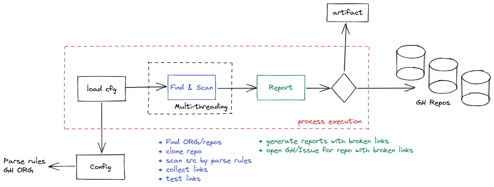
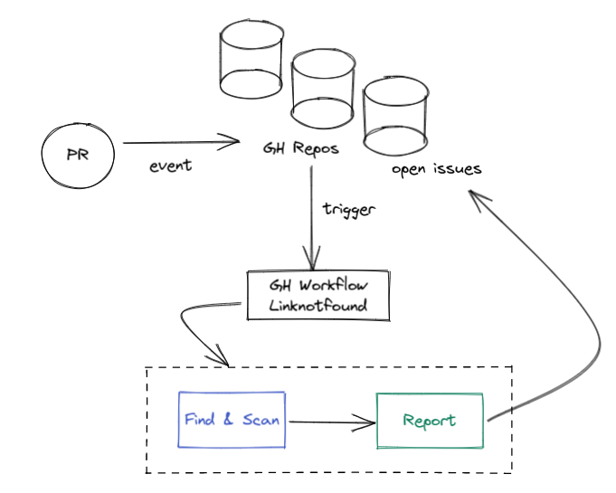

# linknotfound

This project is a POC, [proof of concept](https://en.wikipedia.org/wiki/Proof_of_concept) for a simple tool to find and
report broken links from an application source code.

_This repository doesn't intend to be a final version of this poc, as well should not run in a production
environment, as a public and open-source code you can use it with your own risks and contributions are welcome!._

## diagrams

<br>
_high-level overview with configuration, execution and reporting_

<br>
_automation using GitHub workflow, triggered by new PR event_

## Requirements
* GitHub OauthAPI GITHUB_TOKEN
* Python 3

## Setup dev env

```shell
git clone git@github.com:eduardocerqueira/linknotfound.git
cd linknotfound
sh ops/scripts/set_dev_env.sh
```


## links
* [GitPython](https://github.com/gitpython-developers/GitPython)
* [tips python git repo](https://www.devdungeon.com/content/working-git-repositories-python)

<br><br><br>
[](logo)<br>
_Life is too short to be serious all the time! So, if you can't laugh at yourself, call me... I'll laugh at you._
